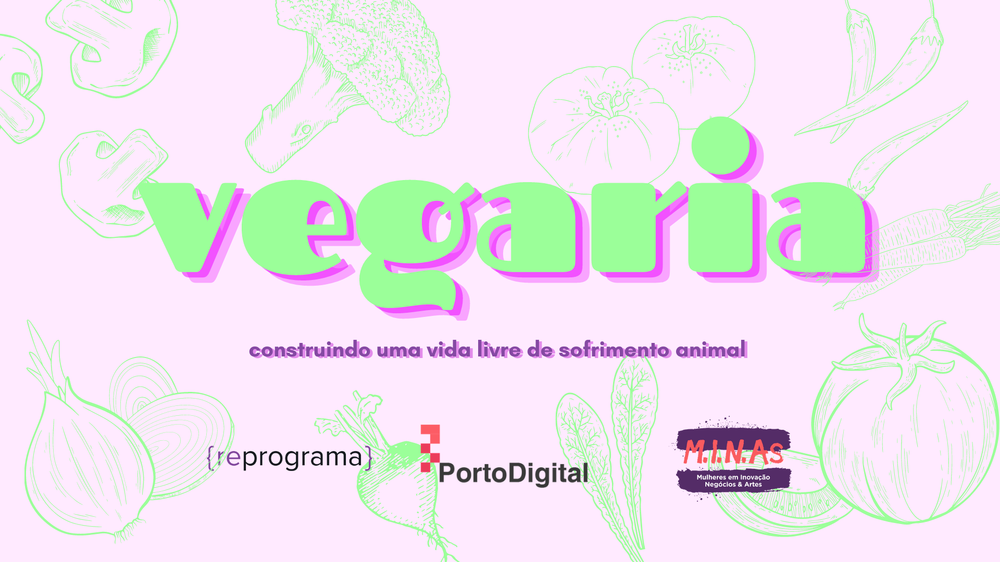
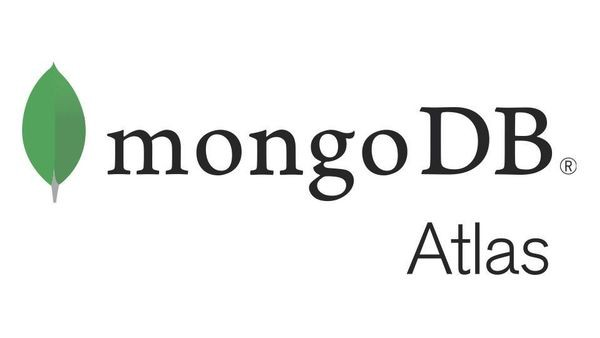
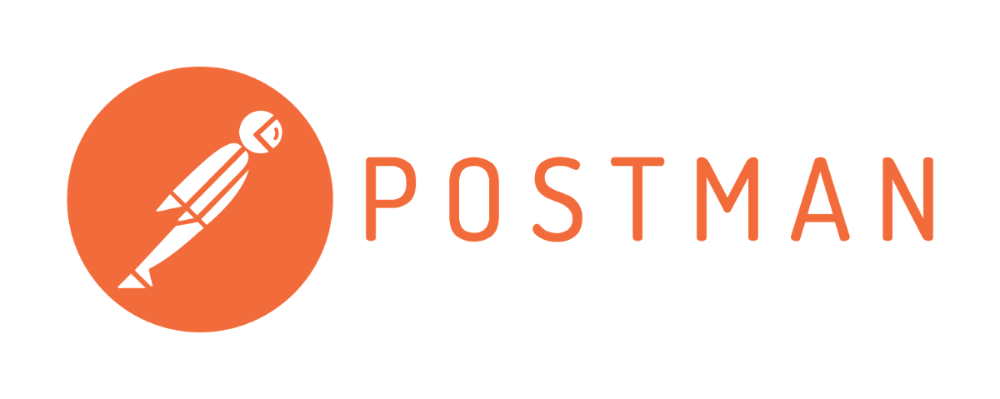

    

# Reprograma + Porto Digital - Mulheres em Inovação, Negócios e Artes (MINAs)

## reprogramaSemanas17e18
## PROJETO FINAL :books: :green_book:

:construction: STATUS - EM DESENVOLVIMENTO :construction:

 

  
 
 

### TÓPICOS

<!--ts-->
   * [Objetivo](#objetivo)
   * [Tecnologias](#tecnologias)
      * [VS Code](#visual-code-studio)
      * [Javascript e NodeJS](#javascript-e-nodejs)
      * [Github](#github)
      * [MongoDB Atlas e Heroku](#mongodb-atlas-e-heroku)
      * [Postman](#postman)
   * [Dependências](#dependencias)
   * [Aprendizados](#aprendizados)
   * [Instruções para Utilização da API](#instrucoes-para-utilizacao-da-api)
   * [Informações sobre as rotas](#informacoes-sobre-as-rotas)
   * [Próximos passos](#proximos-passos)
   * [Autora](#autora)
<!--te-->

## OBJETIVO :new_moon: 

Com a finalidade de consolidar os conhecimentos aprendidos durante o bootcamp de back-end de 18 semanas da {reprograma}, fomos desafiadas a desenvolver uma API capaz de executar um CRUD em um banco de dados. Precisando também fazer o deploy desse projeto no Heroku e documentar o processo por meio desse repositório no Github.

### VEGARIA: cluster de empreendimentos veganos

A fim de apoiar a minha, e a de quem mais tiver interesse, transição do vegetarianismo ao veganismo, criei uma aplicação voltada à união de referências relativas ao estilo de vida vegano, tendo como foco inicial reunir em um só lugar diversos pequenos empreendimentos veganos. 

Para o CRUD solicitado, criarei inicialmente as funções de criar, ler, atualizar e deletar empreendimentos veganos. 

## TECNOLOGIAS :waxing_crescent_moon:

 <a href="#VSCode">Visual Code Studio</a> •
 <a href="#javascript-e-nodejs">Javascript e NodeJS</a> • 
 <a href="#github">Github</a> • 
 <a href="#MongoDB-Atlas-e-Heroku">MongoDB Atlas e Heroku</a> • 
 <a href="#postman">Postman</a> • 
 <a href="#dependências">Dependencias</a>

## VSCode

  
  

O ambiente de desenvolvimento de software utilizado foi o Visual Studio Code, indicado desde as primeiras aulas do curso da {reprograma}.

Ao longo da trajetória do bootcamp eu instalei 4 extensões ao programa: 

1. Live Server: extensão instalada durante o processo de seleção para o curso, em um workshop; 
2. Bracket Pair Colorizer: extensão que ajuda na visualização de chaves, colchetes e parênteses deixando da mesma cor o elemento de abertura e de fechamento e sinalizando quando há um faltante; 
3. Prettier: quando instalada, é possível organizar a identação do código ao invés do comando "Format document with > Prettier"; e
4.  Material Theme Icons: adiciona um ícone ao lado de cada arquivo, havendo ícones iguais pra arquivos de mesmo tipo e ícones diferentes para tipos diferentes.

## JavaScript e NodeJS

  

  

A linguagem de desenvolvimento do projeto foi JavaScript, tendo sido o NodeJS o ambiente de execução da linguagem utilizado. 

## Github

A plataforma github foi utilizada para organização e controle das versões do projeto, tendo sido a linguagem git o meio de contato com essa ferramenta.

# MongoDB Atlas e Heroku

  

  
  

A partir da integração do diretório remoto do Github ao Heroku foi entregue um servidor remoto, o qual foi conectado ao MongoDBAtlas a fim de possibilitar o armazenamento dos dados na nuvem. 

# Postman

Por fim, a fim de testar os métodos HTTP desenvolvidos no empreendimentosController foi utilizado o software Postman. 

# Dependências
Abaixo está uma relação das bibliotecas utilizadas no desenvolvimento do projeto e as versões no momento da última atualização do "README.md".

## APRENDIZADOS :first_quarter_moon:

O projeto final foi o momento de por em prática muitos dos conhecimentos com os quais tive contato ao longo das últimas 18 semanas. 

Além de todas as tecnologias utilizadas no projeto, ao longo dele e de todo o curso consegui consolidar habilidades como transformar problemas complexos em pequenos problemas, fazer as coisas por partes e não me desesperar com erros, mas tentar entendê-los, pesquisar sobre eles e pedir ajuda se necessário.

## INSTRUÇÕES PARA A UTILIZAÇÃO DA API :waxing_gibbous_moon:

São pre-requisitos para o funcionamento do projeto as seguintes ferramentas:

- [Git](https://git-scm.com)
- [Node.js](https://nodejs.org/en/)
- [MongoDB](https://www.mongodb.com/)

Além disso, alguns softwares podem ser utilizados para auxiliar o desenvolvimento e a realização de testes, aqui, indico os seguintes: 

Para auxílio no desenvolvimento:
- [VSCode](https://code.visualstudio.com/)

Para realização de testes dos métodos HTTP:
- [Postman](https://www.postman.com/)

### :sparkles: A fim de utilizar a API criada comece por clonar o repositório em três passos: 

1. Copiar o link 
`https://github.com/marinamare/reprogramaSemanas17e18_projetoFinal.git`
2. Criar um repositório na sua máquina com o nome `reprogramaSemanas17e18_projetoFinal`
3. Abrir o terminal na pasta criada e, efetivamente, clonar o repositório através do comando: 
`git clone https://github.com/marinamare/reprogramaSemanas17e18_projetoFinal.git`

### :sparkles: Depois de clonado o repositório, é importante instalar as dependências do programa através do:
`npm install`

### :sparkles: Posteriormente, é necessário configurar as variáves de ambiente: 

1. Comece por adicionar um arquivo na raiz da pasta reprogramaSemanas17e18_projetoFinal chamado ".env"

    Dentro desse arquivo serão configuradas as informações presentes no arquivo ".env.eample", que são as seguintes: 
    `MONGODB_URL=stringDeConexao
    PORT=porta`

2. No arquivo .env você pode cole o modelo presente no .env.example;

3. No .env, substitua o conteúdo da variável `MONGODB_URL` que é "stringDeConexao" pela URL padrão de acesso ao banco de dados local pelo MongoDB (http://localhost:27017) OU pela url de conexão de um cluster do MongoDB Atlas (caso você queira utilizar o banco de dados na nuvem).

4. No .env, substitua o conteúdo da variável "PORT" por um número de porta a ser utilizada pelo servidor local no momento que ele rodar.

### :sparkles: Caso você opte por rodar localmente, após configurar as variáveis de ambiente no arquivo .env você já pode: 

1. Ir ao terminal, na pasta do projeto, e rodar o servidor através do comando 
`npm run dev`

2. Ir ao software de interação com a API (aqui estamos utilizando o Postman) e testar as rotas propostas no projeto.

## INFORMAÇÕES SOBRE AS ROTAS :full_moon:

Caso você opte por utilizar o postman, pode importar o arquivo "projetoFinalReprograma.postman_collection.json" que é a coleção feita no programa com todas as rotas.

método HTTP      | Rota local       |  Rota Remota
---------------- | -----------------| -------------
POST             | https://localhost:27017/empreendimentos/  | https://vegaria.herokuapp.com/empreendimentos/
GET ALL | https://localhost:27017/empreendimentos/ | https://vegaria.herokuapp.com/empreendimentos/
GET INDEX | https://localhost:27017/ | https://vegaria.herokuapp.com/
GET ATIVOS | https://localhost:27017/empreendimentos/ativos | https://vegaria.herokuapp.com/empreendimentos/ativos
GET BY ID | https://localhost:27017/empreendimentos/:id | https://vegaria.herokuapp.com/empreendimentos/:id
UPDATE | https://localhost:27017/:id | https://vegaria.herokuapp.com/empreendimentos/:id
DELETE | https://localhost:27017/:id | https://vegaria.herokuapp.com/empreendimentos/:id
PATCH | https://localhost:27017/:id | https://vegaria.herokuapp.com/empreendimentos/:id

## PRÓXIMOS PASSOS :zap:

A fim de trilhar uma carreira em tecnologia conciliando minha formação em andamento em design e esse impulso que me foi dado pela {reprograma} em relação à área de desenvolvimento, meus próximos passos em relação ao projeto serão buscar formas de desenvolver e integrar interfaces a cada uma das rotas criadas. 

Escolhi fazer isso através do uso do Atomic Design, iniciando o processo por elementos como botões e caixas de diálogo, criando uma espécie de mini design system que dê uma cara ao projeto e possibilite a produção e testagem mais dinâmica dos fluxos dentro da aplicação.

## AUTORA :octocat: 

  
 <b>Marina Maré</b></a> :ocean:

Feito com :green_heart: por Marina Maré 👋🏽 Entre em contato!

  
